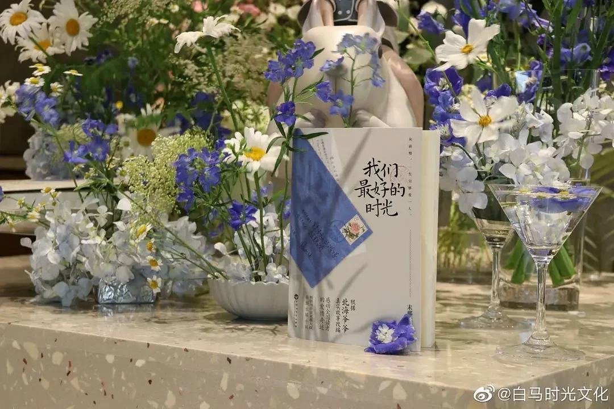
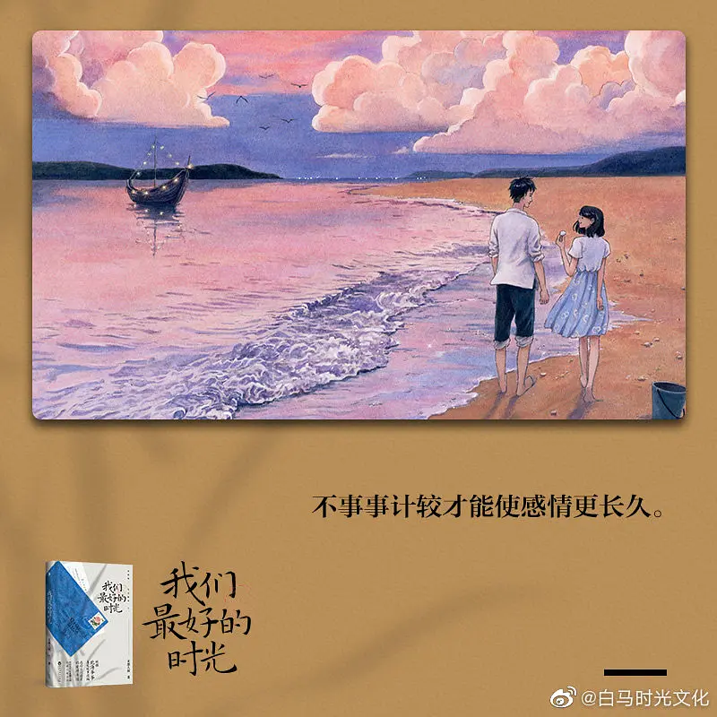
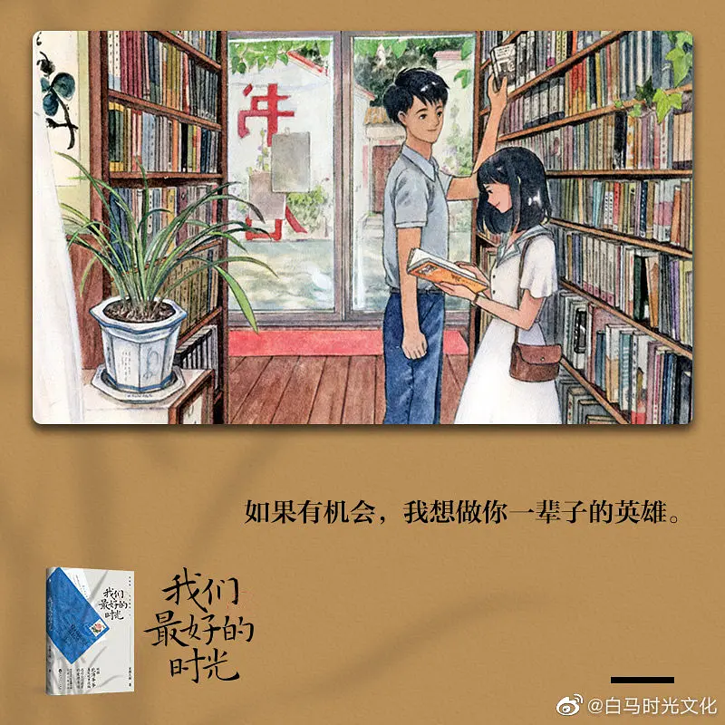
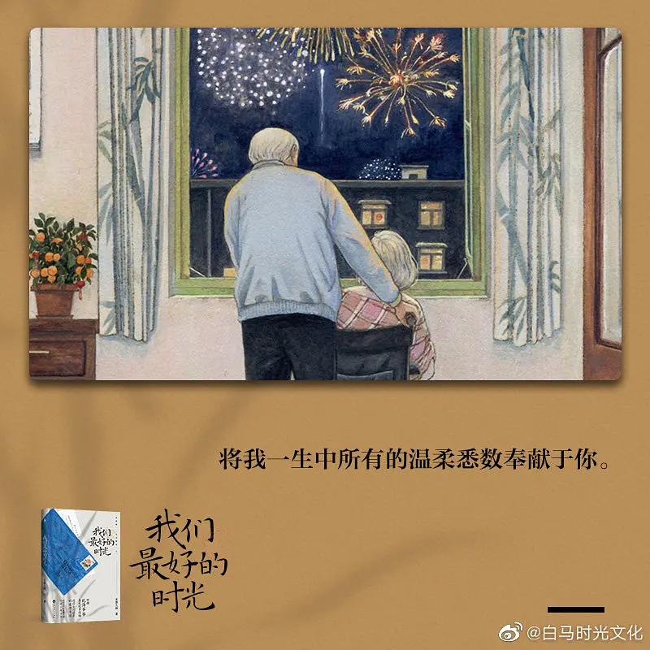
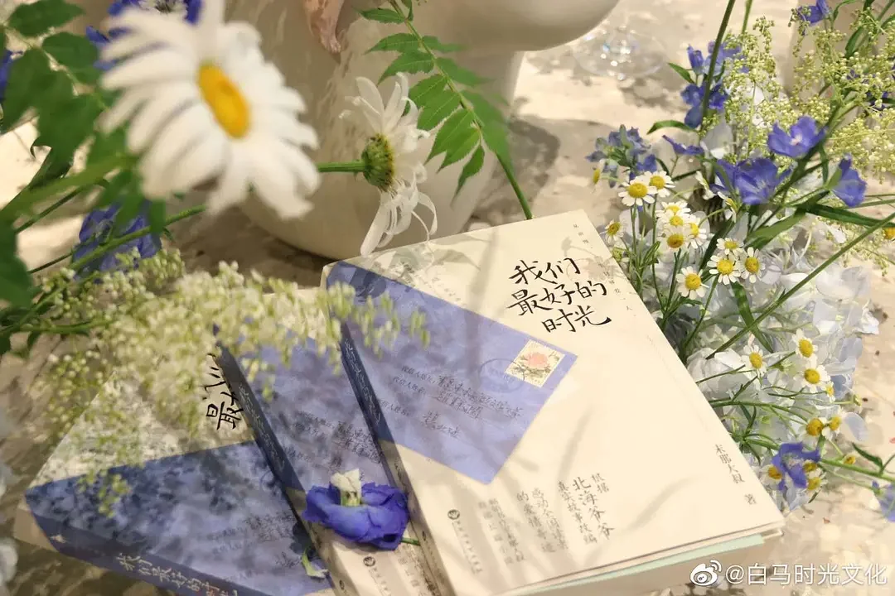

你相信爱情吗？我曾经很多次听到这个问题。

我想，世界上是存在至死不渝的爱情的。

多年前看过《亲爱的，不要跨过这条江》这部韩国纪录片，讲述了98岁的爷爷赵炳万和89岁的奶奶姜溪烈生活的点点滴滴。他们结婚76年，经历风雨，走过风霜，相爱相伴了一生，质朴，平淡，却又催人泪下，刚告诉我们这个世界上存在这样一种爱情，彼此陪伴，互相依赖，将生命融为一体。

**每个人都曾幻想过爱情的样子，也许是轰轰烈烈的刻骨铭心，也许是平平淡淡的相濡以沫，也许是甜甜蜜蜜的细水长流。**

在末那大叔的新书《我们最好的时光》说的也是这样一段质朴岁月里感天动地的真实爱情故事。杨北海和赵静娴缘于一场非浪漫相遇，两颗不同的灵魂碰撞出了奇妙的火花。在这路遥马急的人世间，他们相伴相守的时光，也是他们最好的时光。

## 1.总有些惊奇的际遇，比方说当我遇见你

东方红一号卫星发射成功的那天，26岁的红星车辆厂职工杨北海，被一位散发姑娘拉住请他帮忙带路，还帮助她上了广场台子，这个姑娘在台子中央用手风琴拉了一曲《东方红》，被台下的人群误以为是新厂长，把她的演讲推到了高潮，也让场面一度失控，而真正得到新厂长却落到了无人问津的尴尬局面。

第二天杨北海作为“帮凶”不仅受到了厂里的处分，还被挂了红榜、吃警告、责令当众检讨。那时他才发现这个散发姑娘并不叫“赵前进”而叫“赵静娴”，并且明白那天的赵静娴是早有预谋的，他祈祷不要再遇到这个姑娘。然而，两个人如命中注定般相遇，也在彼此生命中留下浓墨重彩的一笔。

杨北海，是个脾气好的老好人，好到什么程度呢，连厂里食堂扫地阿姨都能指挥他，而杨北海觉得助人为乐是做人的基本准则，只要付出一点劳动就能得到别人的微笑是非常实惠的。

赵静娴，泼辣又善良，嚣张且不怕事儿，她揭发小许偷暖水瓶木塞，但在玉姐打小许，赶小许走的时候站出来维护小许，让她道歉并买新的赔给她们，她讲道理的处理方式，是人群中特立独行的存在。

两个人的第二次交际是在学校，杨北海的弟弟杨北川和赵静娴的妹妹赵静雯，两个人因为家庭成分的问题吵了起来，赵静娴坚持让杨北川当着全校工农子弟兵道歉，还要说明怎么错了，今后怎么改。赵静娴不仅明事理还进退有度，再后来是汇演，两个人因为处理“四旧”书籍才算真正有了近距离接触。

## 2.喜欢是乍见之欢，爱是久处不厌

小许事件是杨北海第一次觉得赵静娴是不同的，因为他们在同一件事情上有着不同的处理方式，两个人的性格完全不同，却让杨北海对赵静娴有了不一样的看法。后来是《海鸥》这本书，让他看到有无数奇怪又可爱的想法的赵静娴，不自觉追随她的脚步，发现她的闪光点。因为两个人这些不同点，所以她在他的心里永远都是新鲜的、不同的。北海为什么会被静娴吸引呢？因为赵静娴是一位真正独立自由的女性，像风一样来到了他的身边。

**有人爱你年轻时的容颜，有人爱你有趣的性格，还有人爱你是因为灵魂的契合，赵静娴对杨北海来说就是这样的存在，她的坚强抗争，她的从不退缩，才是深深打动杨北海的地方。**

杨北海的母亲是一位老师，性格很强势，他从小就不敢忤逆母亲的想法，因为排练的事情已经让母亲很不满，甚至要去找厂里领导理论，但北海并不想四舅舅难办，也不想让静娴失望。因为“四旧”书籍被发现，母亲大发雷霆，母亲从觉得赵静娴疯癫到认定她不是什么好姑娘。在得知两个人恋爱后，更是百般阻拦，甚至觉得自己的儿子思想出了问题。

毫无疑问，母亲是绝对不会同意两个人的婚事，北海早就预料到，他做了一个大胆决定，趁母亲不注意把户口本偷出来，因为他知道，他爱赵静娴这件事，不会后悔。因为赵静娴的出现，给了他前所未有的力量，从稳重，懂事变得成熟，勇敢，这份爱让杨北海成长，知道自己想要的是什么，想过什么样的生活，让他丢弃掉那个委曲求全的自己，变得自由。

**爱一个人，是为他奋不顾身千万次，也是因为他勇敢无畏，更是因为他，成为更好的人。**

## 3.和你在一起，爱就是平淡生活里点滴

你翻过的每一本书，都有我的痕迹；你哼的每一首歌里，都有我的回音。
我这辈子，对于想做的事儿从来没犹豫过，生活、工作、学习都是，爱你也是……

他们对彼此的爱渗透于生活之中。两个人组成一个家，那里有他们共同挑选沙发和地毯，也有可以喝酒吹风的露台。厨房里咕嘟咕嘟地炖着她给他煲的汤，猫就懒洋洋地趴在椅子上。天渐渐黑了，他站在落地窗前看着这个城市温暖的灯光。突然门响了，他张开双臂笑着说回来了。两个人在一起，就是全世界。

爱是柴米油盐，当静娴睡醒的时候，桌子上是北海做好的饭菜，一个喜欢做，一个喜欢品，连做饭都成为生活里特殊的幸福。

爱是包容理解，北海知道静娴不喜欢管账，所以从不让她插手这些，而静娴也变得勤俭持家，让两个人的日子过得舒服自在。

爱是相互陪伴，婚后母亲依旧不满意静娴，两个人无论有什么困难什么都一起面对，互相鼓励，为彼此照亮前方的路。

## 4.从前慢，一生只爱一个人

北海和静娴一路走来，无论发生什么，都坚定的爱着彼此，他们拥有着渗透于生活的、平淡甜蜜的幸福。他们并不常常表达爱，一举一动都是爱的影子，是超越生死的炽热与持久。

静娴病的很重，北海早在得知静娴病情的那刻，就决定即使付出一切也不会放弃，他一如承诺的那样无论发生什么，都不会离她而去。故事的最后，静娴还是离开了，可是，人生的终点并不是死亡而是遗忘，他们还有那浪漫的、幸福的、难忘的一生回忆。

在如今快节奏的生活中，我们常常会听到速食爱情，也感叹不再相信爱情。但是，如果你愿意用一腔温情去呵护，愿意用一颗心去坚定的守护，为什么不愿意试一试呢？

**愿你有人爱，也有人爱。**

